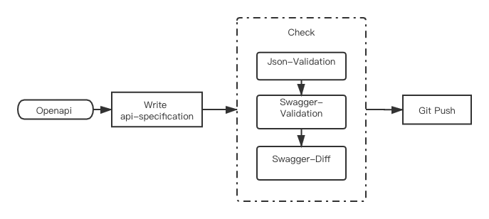

# QingCloud API Specification 规范
## Description
为了统一规范并管理 API 接口，在此项目制定 云平台产品接口描述规范 及一些相关工具。

各产品线 api specs 可以单独维护在其他 gitlab project 并作为此项目的 submodule 统一发布。

## Index
1. [OpenAPI Specification 规范说明](#Specification)
2. [主项目结构说明](#DirectoryStructure)
3. [创建 api specs 子项目](#Use)
    1. [子项目结构](#StructureOfSubproject)
    2. [子项目建立依赖](#Submodule)
    3. [编写swagger](#CreatingSwagger)
    4. [GitLab CI](#GitLabCI)
4. [注意事项](#Note)

## Specification<a name="Specification"/>
- API 接口都以 [OpenAPI Specification (Swagger) v2.0](https://swagger.io/specification/v2/) 为规范, 统一使用json格式。
- 在此基础上，添加自定义参数，具体请参考[creating-swagger](./documentation/creating-swagger.md)

| param | type | description | comment |
| --- | --- | --- | --- |
| x-scope | string |接口权限说明 | 可选 private，public，默认 public |
| x-description | object | 描述(i18n) | - |
| x-example | object | 请求示例 | - |

## Directory Structure<a name="DirectoryStructure"/>
- **documentation**: 相关文档目录，关于 spec 书写规范，检查清单等。
  
- **specification**: 各产品线 api specs 的汇总目录。

- **tools**: 工具存放目录，代码生成，swagger 静态检查，兼容性检查等。

- **scripts**: 脚本存放目录。
 
## Use<a name="Use"/>
### Structure Of subproject<a name="StructureOfSubproject"/>
```sh
./specs   # API specs 目录
    ├── volume    # 子模块文件夹
    │   ├── example   # 子模块的示例文件夹
    │   │   ├── DescribeVolumes.json
    │   │   └── CreateVolumes.json
    │   └── volume.json   # 子模块的 API spec 
    ├── parameters.json   # 通用的 parameters
    ├── definitions.json  # 通用的 definitions
    └── api-profile.json  # 主服务用的 api paths 汇总
```

- 各项目(产品)以 submodule 的模式在specification 下创建对应目录
- 各子模块，拥有单独的 swagger spec 存在在对应的文件夹中
- 每个子模块用对应的 **请求示例文件** (example)，示例文件应和 API operationId 同名。
- **api-profile.json** 是所有 api 的 paths 汇总文件。
- **parameters.json** 和 **definitions.json** 为公用 parameters/definitions 的定义文件。


### Submodule<a name="Submodule"/>
建立主项目与子模块的依赖关系。

主项目初始化
```shell
git submodule init
```
添加子项目依赖
```shell
git submodule add -b {branch} \
  ../../{group}/{project}.git \
  specification/{project}
```
**建议主项目和子项目分支一一对应。**

提交配置
```shell
git add specification/{project} ./.gitmodules
git commit -m "[build]: add {project} submodule"
git push origin master
```

### Creating Swagger<a name="CreatingSwagger"/>

1. 请按照 doc 中的规范编写 API spec 文件。
   > 可以参考 [swagger-bootstrap.json](./documentation/swagger-bootstrap.json) 
2. 执行 [check 脚本](./scripts/README.md)，按照 [check-list](./documentation/swagger-checklist.md) 对 spec 文件进行检查。
	```sh
	sh ./check-script.sh
	```
3. 根据检查后的反馈进行修改，然后 push。

### GitLab CI<a name="GitLabCI"/>
建议各子项目(api specs)用GitLab CI 进行持续集成，例如 swagger 静态检查，自动生成 API 文档等。
具体配置请参考[setup-gitlab-CI](documentation/gitlab-CI/setup-gitlab-CI.md)。

## Note<a name="Note"/>
1. 各产品线 api specs 可以单独维护在其他 gitlab project 并作为此项目的 submodule 统一发布。
    > 开发前请阅读规范文档，开发后请按照检查清单进行自查
1. 建议各子项目，基于接口描述来自动生成 **doc/sdk/cli/request model(调用层)** 代码。 
1. 有些 **接口/参数/返回** 是区分普通用户和管理员权限的，可通过设置“x-scope”参数区分（用于生成 **公开版和私有版** 的代码或文档），目前 snips 支持在 manifest 配置 scope。
1. 基于接口描述生成 API 接口文档，在spec中需要有相应的 **示例** （x-example）和 **中英文描述说明**（英文默认使用 "description" 参数，中文以及其他语言在 "x-description" 中设置），目前 snips 支持在 manifest 配置 language。
