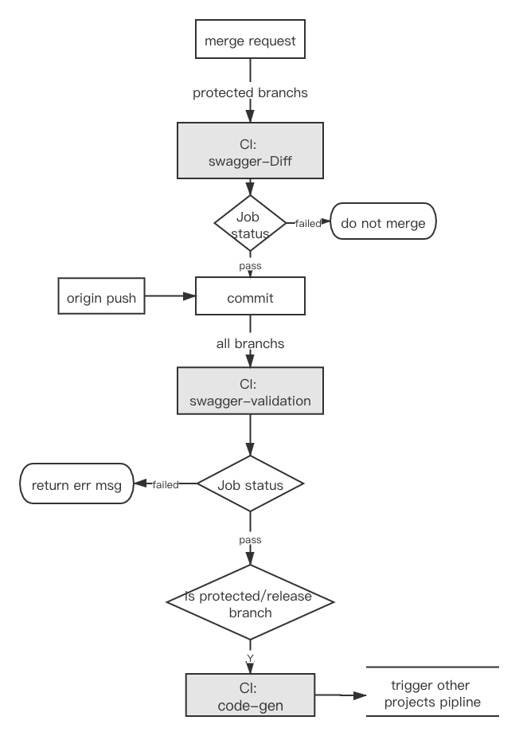
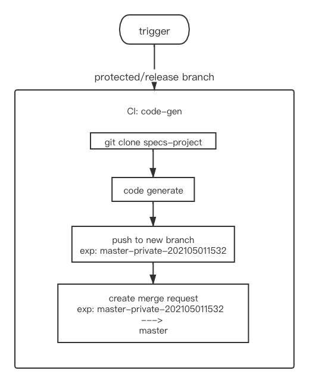

# Gitlab-CI

## Description
该文档介绍如何使用 Gitlab-CI/CD 进行 swagger-validation 以及 code-gen。

## Create .gitlab-ci.yml
### api-specs-project


#### jobs
* swagger-validation: 校验 swagger 的合法性。
    - commit/push：适用于所有分支
    - merged result：适用于所有分支
          
* swagger-diff：用于对于 swagger 的修改项和兼容性问题。
    - merge request：仅对 protected 分支使用(例如：master，staging，dev)
    
* code-gen-trigger（建议）: 触发 code-gen 项目的生成代码 job。必须再通过 swagger-validation 后才会执行
    - merged result：仅对 protected 分支使用(例如：master，staging，dev)
    - commit/push：仅对 protected 分支使用(例如：master，staging，dev)
    
#### .gitlab-cl.yml
以下 _.gitlab-cl.yml_ 可供参考。
```yaml
image: qingcloud/openapi-tools  # pipeline 运行的镜像，以下所有 script 都在该镜像中执行。

stages:   # 用于定义场景阶段，决定执行顺序
  - validation
  - diff
  - code_gen

valid_job:
  stage: validation 
  tags:  # 指定哪个ci runner跑该工作
    - docker
  script:
    - REPO=$PWD
    - cd /app
    - lint-openapi $REPO/specs/api-profile.json -r spectral.yml -c validaterc
    
  
compare_job:
  stage: diff
  tags:
    - docker
  script:
    # 获取待 merge 的分支名称
    - >
     CI_TARGET_BRANCH_NAME=$(
      curl -LsS -H "PRIVATE-TOKEN: $PERSONAL_ACCESS_TOKEN" 
      "http://$CI_SERVER_HOST/api/v4/projects/$CI_PROJECT_ID/merge_requests?source_branch=$CI_COMMIT_REF_NAME" | 
      jq --raw-output ".[0].target_branch")    
    # 拉取代码
    # 其中自定义参数(setting--CI/CD--variables)：
    #   GITLAB_SERVER_HOST：gitlab url
    - git clone -b $CI_TARGET_BRANCH_NAME https://gitlab-ci-token:${CI_JOB_TOKEN}@$GITLAB_SERVER_HOST/$CI_PROJECT_NAMESPACE/$CI_PROJECT_NAME.git ./target_branch
    - java -jar /app/openapi-diff-cli.jar --fail-on-incompatible 
      ./specs/api-profile.json ./target_branch/specs/api-profile.json
  only:
    variables:
      # 仅在 merge request 时触发
      - $CI_PIPELINE_SOURCE == "merge_request_event"

code_gen_job:
  stage: code_gen
  tags:
    - docker
  script:
    # 调用 api 触发 code-gen pipeline
    # 其中自定义参数(setting--CI/CD--variables)：
    #   CI_DOC_PIPELINE_TOKEN：document 项目的 trigger pipeline token
    #   CI_DOC_PROJECT_ID：document 项目的 ID
    #   PROJECT_DEPLOY_USER: deploy username, 用于读取 specs 仓库
    #   PROJECT_DEPLOY_TOKEN: deploy token, 用于读取 specs 仓库
    # ------------------------
    # trigger/pipeline 传参说明：
    #   SPECS_PROJECT_PATH: api-specs 项目路径
    #   SPECS_SCOPE: 解析 specs 的 scope，"private" 或 "public"
    #   SPECS_PROJECT_SPATH: 可选，如果"specs"不在根目录的时填写。
    - >
      curl --request POST  
        -F token=${CI_DOC_PIPELINE_TOKEN}  
        -F ref=master 
        -F "variables[SPECS_PROJECT_DEPLOY_USER]=$PROJECT_DEPLOY_USER"  
        -F "variables[SPECS_PROJECT_DEPLOY_TOKEN]=$PROJECT_DEPLOY_TOKEN"  
        -F "variables[SPECS_PROJECT_PATH]=$CI_PROJECT_NAMESPACE/$CI_PROJECT_NAME"  
        -F "variables[SPECS_SCOPE]=private"  
        https://$CI_SERVER_HOST/api/v4/projects/${CI_DOC_PROJECT_ID}/trigger/pipeline
  only:
    - master

```

### code-gen

#### jobs
* code-gen: 生成代码。
    - trigger：通过 api-specs 调用api触发，仅对 protected 分支使用(例如：master，staging，dev)

#### .gitlab-ci.yml
```yaml
.functions: &functions |
  function traverse_dir() {
    for file in `ls $1`;do
      if [ -d $1"/"$file ];then
        if [ $file = "specs" ];then
          generator $1"/"$file
        else
          traverse_dir $1"/"$file
        fi
      fi
    done
  } 
  
  function generator() {
    SPECS_PATH=$1
    /app/snips -f $SPECS_PATH/api-profile.json  -t ./api/template -o ./api  -s $SPECS_SCOPE
    RET=$?
  }
  


image: qingcloud/openapi-tools

before_script:
  # 加载函数
  - *functions
  # 使用宿主机的密钥，进行验证
  - 'command -v ssh-agent >/dev/null'
  - eval $(ssh-agent -s)
  - echo "$SSH_PRIVATE_KEY" | tr -d '\r' | ssh-add -
  - mkdir -p ~/.ssh && touch ~/.ssh/known_hosts
  - ssh-keyscan -t rsa $GITLAB_SERVER_HOST 2>&1 >> ~/.ssh/known_hosts
  - chmod 700 ~/.ssh && chmod 644 ~/.ssh/known_hosts

doc_gen_job:
  tags:
    - api-specs

  script:
    # 其中自定义参数(setting--CI/CD--variables)：
    #   GITLAB_SERVER_HOST：gitlab host
    #   PERSONAL_USERNAME：用于push
    #   PERSONAL_ACCESS_TOKEN: 用于push
    - DATE=$(date "+%Y%m%d%H%M%S")
    - NEW_BRANCH=${CI_COMMIT_REF_NAME}_${SPECS_SCOPE}_${DATE}

    - SPECS_ROOT=/app/api-specs/$SPECS_PROJECT_SPATH
    # 拉取 specs 
    - git clone -b master https://$SPECS_PROJECT_DEPLOY_USER:$SPECS_PROJECT_DEPLOY_TOKEN@$GITLAB_SERVER_HOST/$SPECS_PROJECT_PATH.git /app/api-specs

    - git config --global user.email "${GITLAB_USER_EMAIL}"
    - git config --global user.name "${GITLAB_USER_NAME}"
    - git checkout -B $NEW_BRANCH
    
    # 遍历 specs 目录生成 
    - traverse_dir $SPECS_ROOT 

    - git add ./api
    - >
      git commit -m "[update] auto update ${SPECS_SCOPE} ${DATE}" &&
      git push git@$GITLAB_SERVER_HOST:$CI_PROJECT_NAMESPACE/$CI_PROJECT_NAME.git -u $NEW_BRANCH && 
      curl "https://$GITLAB_SERVER_HOST/api/v4/projects/$CI_PROJECT_ID/merge_requests" # 通过 api 发起 merge request
      --header "PRIVATE-TOKEN: $PERSONAL_ACCESS_TOKEN"
      --form "id=$CI_PROJECT_ID"
      --form "title=auto update ${SPECS_SCOPE} ${DATE}"
      --form "source_branch=$NEW_BRANCH"
      --form "target_branch=$CI_COMMIT_REF_NAME"
      --form "remove_source_branch=true"
  
  only:
    variables:
      # 仅通过 trigger 
      - $CI_PIPELINE_SOURCE == "trigger"
```
## Variables
预定义的 CI/CD 的变量，在进行 CI/CD pipeline 时都是有效的。具体参数请参考 [官方文档](https://docs.gitlab.com/ee/ci/variables/predefined_variables.html) 。
> 使用时请注意参数有效的 GitLab version（公司目前是 11.1.8）

### Custom variables
| key  | scope |comment | example | 
| ---  | --- | --- | --- |
| GITLAB_SERVER_HOST |  global  | gitlab 域名 | git.internal.yunify.com
| PROJECT_DEPLOY_TOKEN | project | 仅读仓库|  |
| PROJECT_DEPLOY_USER | project | 仅读仓库 |  |
| CI_DOC_PIPELINE_TOKEN | project | trigger pipeline
| CI_DOC_PROJECT_ID | project | trigger pipeline
| PERSONAL_USERNAME | user's projects | 用于调用 api，读写仓库
| PERSONAL_ACCESS_TOKEN | user's projects | 用于调用 api，读写仓库


## Gitlab Runner
```ini
[runners.docker]
    image = "qingcloud/openapi-tools"
    privileged = false
    disable_entrypoint_overwrite = false
    oom_kill_disable = false
    disable_cache = false
    # 使用外部的 docker.sock ，也就是间接地使用了 runner 的宿主机的 docker
    volumes = ["/cache", "/run/docker.sock:/run/docker.sock"]
    # Runner会首先检查本地是否有该image，如果有则用本地的，如果没有则从远程拉取
    pull_policy = ["if-not-present"]
    shm_size = 0
```